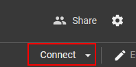

# ava

implementation of preprint **Dynamic sky replacement and video harmonization** 
that automatically generate realistic and dramatic sky backgrounds in videos with controllable 
styles.

## take ava for a spin !
<!-- ### locally
you can clone the project and run it locally
```bash
git clone https://github.com/slowy07/ava
cd ava
pip install -r requirements.txt
``` -->

### online
<!-- or  -->
run it online using google colab, you can check it out at [ava google colab](https://colab.research.google.com/drive/1Hgi09hung57bnNIun4L7n93LpEb-beLk?usp=sharing) or copy paste the link directly
```
https://colab.research.google.com/drive/1Hgi09hung57bnNIun4L7n93LpEb-beLk?usp=sharing
```
#### how to use

1. click the `connect` button\
  
2. then run it by opening the `runtime` tab, then click `run all`\
  
3. wait for result


## our device requirements

our testing so far do in online and offline testing

**online testing**

- Nvidia GPU Server TESLA K80
- 12 GB Rams

**offline testing and running including maintance**

im testing on my personal computer which test on device:

- 16 core of processor Ryzen 9 Model 100-100000059WOF 5900x
- 32 GB of Ram Model F4-4000C17D-32GTZRB Z 4000 Mhz
- Geforce RTX 3090 24GB

## output result


## performance

| resoulution | speed per fps (read) | 
| :--------: | :------------------: |
| 640×360 | 25.03 |
| 854×480 | 20.92 |
| 1280×720 | 19.72 |

## paper
you can also check out the ava output paper, titled [Ava (Dynamic sky replacement and video harmonization)](https://github.com/slowy07/paper/blob/main/Ava.pdf?raw=true)\
from:
```
https://github.com/slowy07/paper/blob/main/Ava.pdf
```
